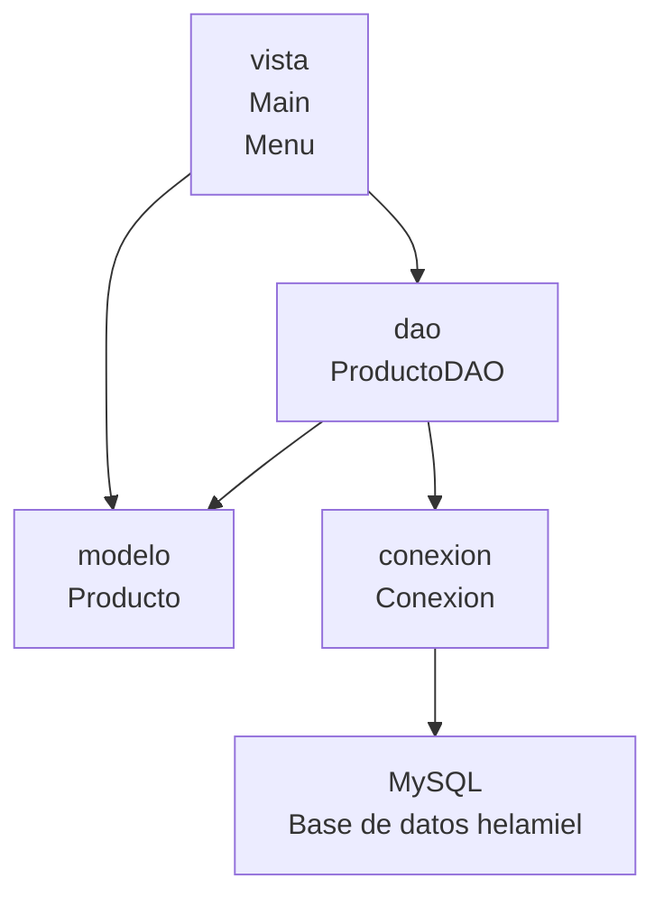

# Documentacion tecnica del proyecto HELAMIEL-JDBC

## Introduccion

HELAMIEL-JDBC es una aplicacion Java de consola orientada a objetos para gestionar productos almacenados en una base de datos MySQL. El proyecto utiliza JDBC para realizar operaciones de persistencia y Maven para administrar la configuracion general y las dependencias.

La aplicacion esta organizada con una estructura MVC, lo que permite separar la presentacion en consola, la representacion de datos, el acceso a la base de datos y la configuracion de conexion.

## Objetivo

El objetivo del proyecto es implementar una base funcional para administrar productos mediante operaciones CRUD: insertar, consultar, actualizar y eliminar registros. La aplicacion busca servir como ejemplo practico de integracion entre Java 17, JDBC y MySQL usando buenas practicas de organizacion por paquetes.

## Tecnologias utilizadas

- Java 17: lenguaje principal del proyecto.
- Maven: herramienta de construccion y gestion de dependencias.
- JDBC: API de Java usada para la conexion y ejecucion de sentencias SQL.
- MySQL: sistema gestor de base de datos relacional.
- MySQL Connector/J: driver JDBC oficial para conectar Java con MySQL.
- Git: sistema de control de versiones.
- Markdown: formato usado para la documentacion del proyecto.

## Arquitectura MVC

El proyecto aplica el patron MVC mediante una separacion sencilla por paquetes:

- Modelo: contiene la clase `Producto`, encargada de representar la entidad principal del sistema.
- Vista: contiene las clases `Menu` y `Main`, responsables de la interaccion por consola.
- Acceso a datos: contiene `ProductoDAO`, que centraliza las operaciones SQL.
- Conexion: contiene `Conexion`, responsable de crear conexiones JDBC con MySQL.

Aunque el proyecto no incluye un paquete `controlador`, la clase `Menu` cumple temporalmente el papel de coordinar las acciones del usuario con el DAO. En una ampliacion futura, esa coordinacion podria moverse a un controlador dedicado.

## Explicacion del uso de JDBC

JDBC permite que la aplicacion Java se conecte a MySQL y ejecute operaciones SQL. En este proyecto se utiliza de la siguiente manera:

1. La clase `Conexion` carga el driver `com.mysql.cj.jdbc.Driver`.
2. `Conexion.getConnection()` abre una conexion hacia `jdbc:mysql://localhost:3306/helamiel`.
3. `ProductoDAO` solicita una conexion cada vez que necesita ejecutar una operacion.
4. Las consultas se ejecutan con `PreparedStatement`, lo que permite enviar parametros de forma segura y ordenada.
5. Las consultas de lectura usan `ResultSet` para recorrer los resultados.
6. Cada fila leida desde MySQL se transforma en un objeto `Producto`.
7. Los recursos JDBC se cierran automaticamente mediante `try-with-resources`.

El uso de `PreparedStatement` mejora la seguridad frente a inyeccion SQL y facilita el mantenimiento de las consultas.

## Diagrama de paquetes

## Descripcion de cada clase

### Conexion

Ubicacion: `src/main/java/conexion/Conexion.java`

Clase utilitaria responsable de abrir conexiones JDBC con la base de datos MySQL. Define el driver, la URL, el usuario y la contrasena. Su metodo principal es `getConnection()`, que retorna una instancia de `Connection` o lanza una excepcion SQL si ocurre un problema.

Buenas practicas aplicadas:

- Clase marcada como `final`.
- Constructor privado para evitar instancias innecesarias.
- Manejo de errores mediante `SQLException`.
- Configuracion centralizada de conexion.

### Producto

Ubicacion: `src/main/java/modelo/Producto.java`

Clase modelo que representa la tabla `Productos`. Contiene los atributos `idProducto`, `nombre`, `categoria`, `precio`, `stock` y `estado`.

Buenas practicas aplicadas:

- Atributos privados.
- Constructor vacio.
- Constructor completo.
- Metodos getter y setter.
- Metodo `toString()`.
- Uso de `BigDecimal` para el precio, adecuado para valores monetarios.

### ProductoDAO

Ubicacion: `src/main/java/dao/ProductoDAO.java`

Clase encargada del acceso a datos de productos. Implementa las operaciones CRUD mediante JDBC y `PreparedStatement`.

Metodos principales:

- `insertarProducto(Producto producto)`: registra un nuevo producto.
- `listarProductos()`: obtiene todos los productos.
- `buscarProducto(int idProducto)`: busca un producto por su identificador.
- `actualizarProducto(Producto producto)`: actualiza un producto existente.
- `eliminarProducto(int idProducto)`: elimina un producto por id.

Buenas practicas aplicadas:

- Uso de constantes para las consultas SQL.
- Uso de `PreparedStatement`.
- Cierre automatico de recursos.
- Uso de `Optional<Producto>` para representar busquedas sin resultado.
- Uso de `Logger` para registrar errores.
- Metodos auxiliares para evitar duplicacion.

### Menu

Ubicacion: `src/main/java/vista/Menu.java`

Clase encargada de mostrar el menu de consola e interactuar con el usuario mediante `Scanner`. Desde esta clase se invocan los metodos del `ProductoDAO` segun la opcion seleccionada.

Opciones disponibles:

- `1 Insertar`
- `2 Consultar`
- `3 Actualizar`
- `4 Eliminar`
- `5 Salir`

Buenas practicas aplicadas:

- Constantes para las opciones del menu.
- Validacion de entradas numericas y booleanas.
- Uso de `BigDecimal` para leer precios.
- Metodo auxiliar para mostrar mensajes de resultado.

### Main

Ubicacion: `src/main/java/vista/Main.java`

Clase principal del proyecto. Contiene el metodo `main()` y se encarga de iniciar la aplicacion creando una instancia de `Menu` y llamando al metodo `iniciar()`.

## Flujo CRUD

### Insertar

1. El usuario selecciona la opcion `1 Insertar`.
2. `Menu` solicita nombre, categoria, precio, stock y estado.
3. Se crea un objeto `Producto`.
4. `ProductoDAO.insertarProducto()` recibe el objeto.
5. Se ejecuta una sentencia `INSERT` con `PreparedStatement`.
6. MySQL genera el `id_producto`.
7. El DAO asigna el id generado al objeto `Producto`.
8. El menu informa si la operacion fue exitosa.

### Consultar

1. El usuario selecciona la opcion `2 Consultar`.
2. `Menu` llama a `ProductoDAO.listarProductos()`.
3. El DAO ejecuta una sentencia `SELECT`.
4. Cada fila del `ResultSet` se convierte en un objeto `Producto`.
5. Se retorna una lista de productos.
6. El menu muestra los productos en consola.

### Actualizar

1. El usuario selecciona la opcion `3 Actualizar`.
2. `Menu` solicita el id del producto.
3. `ProductoDAO.buscarProducto()` verifica si el registro existe.
4. Si existe, el usuario ingresa los nuevos datos.
5. `ProductoDAO.actualizarProducto()` ejecuta una sentencia `UPDATE`.
6. El menu informa si la actualizacion fue exitosa.

### Eliminar

1. El usuario selecciona la opcion `4 Eliminar`.
2. `Menu` solicita el id del producto.
3. `ProductoDAO.eliminarProducto()` ejecuta una sentencia `DELETE`.
4. El menu informa si la eliminacion fue exitosa.

## Conclusiones

HELAMIEL-JDBC implementa una estructura clara para una aplicacion Java con conexion a MySQL. El uso de MVC mejora la organizacion del codigo y facilita futuras ampliaciones. JDBC permite controlar de forma directa las operaciones SQL, mientras que `PreparedStatement` aporta seguridad y orden en la ejecucion de consultas.

El proyecto queda preparado para crecer con nuevas entidades, controladores, validaciones, pruebas unitarias o una interfaz grafica, manteniendo una base tecnica limpia y comprensible.
